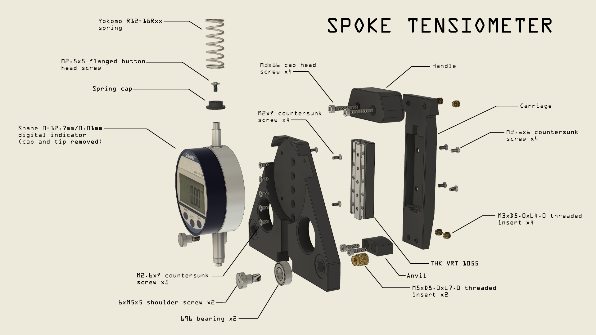
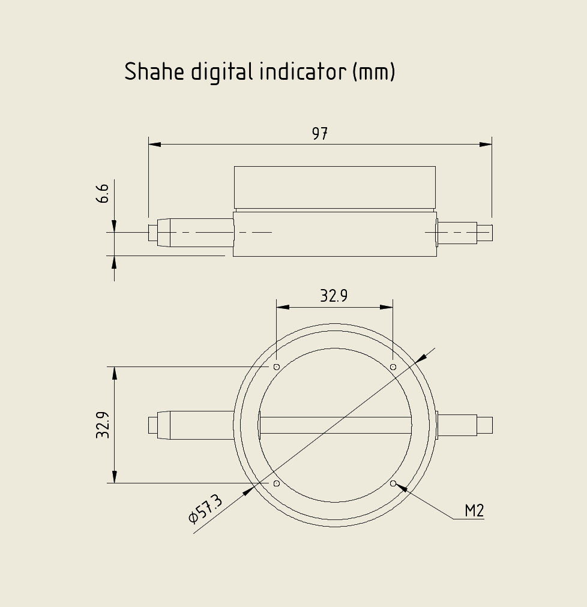

# 3D printed spoke tensiometer (or tension meter if you prefer)

<h1>3D printed spoke tensiometer <small>(or tension meter if you prefer)</small></h1>

3D printed spoke tensiometer based on Jobst Brandt's and Filip Kralyevski's designs.

*This is a work in progress*

## Parts that I used
### Indicator
- Shahe digital indicator, 0-12.7mm range, 0.01mm resolution (https://www.aliexpress.com/item/32823445866.html)
### Motion
- THK VRT 1055 cross-roller table (https://www.ebay.co.uk/itm/185530610857)
### Fasteners
- M2x6 phillips countersunk screw x 4 (https://www.aliexpress.com/item/32869347610.html)
- M2.5x5 socket flanged button screw x 1 (https://www.ebay.co.uk/itm/175312432319)
- M2.6x6 phillips countersunk screw x 9 (https://www.aliexpress.com/item/4001066920056.html)
- M3x12 socket cap head screw x 2
- M3x20 socket cap head screw x 2
- M5xD6xL5 shoulder screw x 2 (https://www.aliexpress.com/item/1005004367176439.html)
- M3xD5.0xL4.0 threaded inserts x 4 (https://www.aliexpress.com/item/4000761483243.html)
- M5xD8.0xL7.0 threaded inserts x 2 (https://www.aliexpress.com/item/4000232990523.html)
### Bearings
- 696 bearing (ID6xOD15xW5) x 2 (https://simplybearings.co.uk/shop/p152950/Major-Branded-696ZZ-Metal-Shielded-Deep-Groove-Ball-Bearing-6x15x5mm/product_info.html)
### Spring
- Yokomo R12-18RSS (https://www.ebay.co.uk/itm/225038344901)

## Spring
### Yokomo R12-18RSS
- Wire diameter: 1.2mm
- Outside diameter: 11.9mm
- Free length: 30.1mm
- Ends: Squared and ground
- Rate: approx 2N/mm

### Alternatives from Yokomo:
- R12-18RSS - soft
- R12-18RSM - medium
- R12-18RSH - hard
- R12-18RSSH - super hard

## Indicator dimensions

## Link to Fusion 360 online viewer
https://a360.co/3s8aMI6
