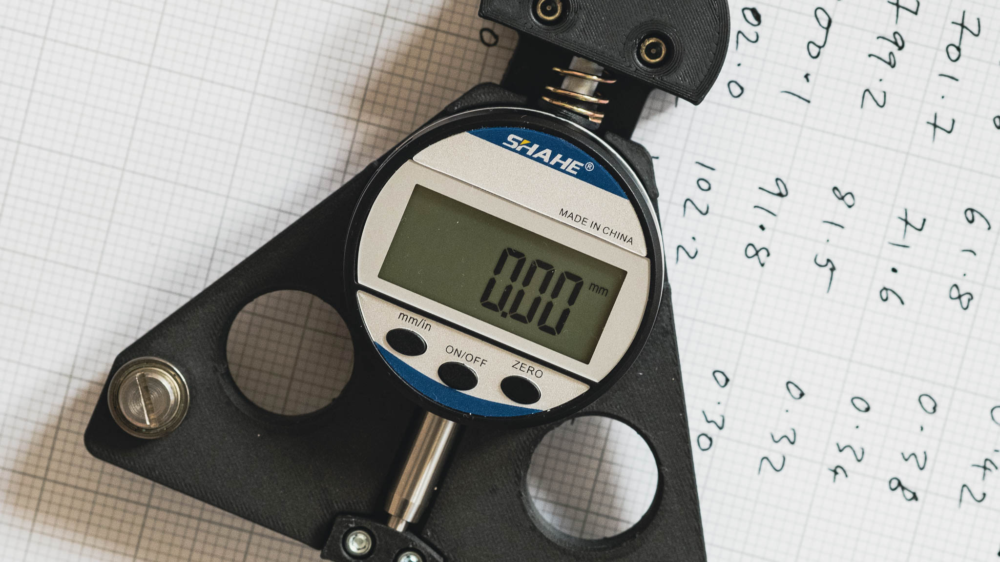

# 3D printed spoke tensiometer

3D printed spoke tensiometer (or *tension meter* if you prefer) based on Jobst Brandt's and Filip Kralyevski's designs.

This is a work in progress.

## Parts
* Indicator:
	* Shahe digital indicator, 0-12.7mm range, 0.01mm resolution (https://www.aliexpress.com/item/32823445866.html)
* Motion:
	* THK VRT 1055 cross-roller table (https://www.ebay.co.uk/itm/185530610857)
* Fasteners:
	* M2x8 phillips countersunk screw x4 (https://www.aliexpress.com/item/32869347610.html)
	* M2.5x5 socket flanged button screw x1 (https://www.ebay.co.uk/itm/175312432319)
	* M2.6x6 phillips countersunk screw x4 (https://www.aliexpress.com/item/4001066920056.html)
	* M2.6x8 phillips countersunk screw x5 (https://www.aliexpress.com/item/4001066920056.html)
	* M3x16 socket cap head screw x4
	* D6xL5xM5 shoulder screw x2 (https://www.aliexpress.com/item/1005004367176439.html)
	* M3xD5.0xL4.0 threaded inserts x4 (https://www.aliexpress.com/item/4000761483243.html)
	* M5xD8.0xL9.0 threaded inserts x2 (https://www.aliexpress.com/item/4000232990523.html)
* Bearings:
	* 696 bearing (ID6xOD15xW5) x2 (https://simplybearings.co.uk/shop/p152950/Major-Branded-696ZZ-Metal-Shielded-Deep-Groove-Ball-Bearing-6x15x5mm/product_info.html)
* Spring:
	* Yokomo R12-18RSS (https://www.ebay.co.uk/itm/225038344901)

## More on parts
* Indicator:
	* Any dial or digital indicator with the same dimensions, or others with modifications to the printed parts
	* 
* Spring:
	* the R12-18RSS dimensions are:
		* wire diameter: 1.2mm
		* outside diameter: 11.9mm
		* free length: 30.1mm
		* ends: Squared and ground
		* spring rate: approx 2N/mm
	* Other Yokomo springs with the same dimensions
		* R12-18RSS - soft
		* R12-18RSM - medium
		* R12-18RSH - hard
		* R12-18RSSH - super hard
	* Alternatively, any spring that fits e.g. Lee Spring
* Fasteners:
	* The shoulder screws details are
		* shoulder diameter: 6mm
		* shoulder length: 5mm
		* thread: M5
	* ultra-low head shoulder screws are an option from, for example: https://www.wdscomponents.com/en-gb/ultra-low-head-stainless-steel-shoulder-bolts-wds-887/c-526/p-47459/v-47478 and https://www.mcmaster.com/screws/shoulder-screws-4/system-of-measurement~metric/shoulder-length~5-mm/thread-size~m5/socket-head-profile~ultra-low/
	* M2.6 screws for the cross-roller table:
		* McMaster-Carr has a few options https://www.mcmaster.com/screws/system-of-measurement~metric/thread-size~m2-6/
	* M2.5 flanged screw:
		* a screw plus washer would do the same job

## Link to Fusion 360 online viewer
https://a360.co/3N3vXVd
